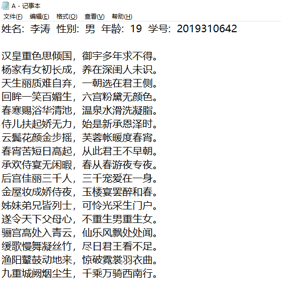

# Java5
# shiyan5
shiyan5
# shiyan5
Java-experience5
### 一、实验目的
##### 掌握字符串String及其方法的使用
##### 掌握文件的读取/写入方法
##### 掌握异常处理结构
### 二、实验内容
##### 在某课上,学生要提交实验结果，该结果存储在一个文本文件A中。
##### 文件A包括两部分内容：
##### 一是学生的基本信息；
##### 二是学生处理后的作业信息，该作业的业务逻辑内容是：利用已学的字符串处理知识编程完成《长恨歌》古诗的整理对齐工作，写出功能方法，实现如下功能：
##### 1.每7个汉字加入一个标点符号，奇数时加“，”，偶数时加“。”
##### 2.允许提供输入参数，统计古诗中某个字或词出现的次数
##### 3.输入的文本来源于文本文件B读取，把处理好的结果写入到文本文件A
##### 4.考虑操作中可能出现的异常，在程序中设计异常处理程序
### 三、实验要求
##### 设计学生类（可利用之前的）；
##### 采用交互式方式实例化某学生；
##### 设计程序完成上述的业务逻辑处理，并且把“古诗处理后的输出”结果存储到学生基本信息所在的文本文件A中。
### 四、流程图

### 五、实验步骤
##### 1.首先创建Student类和Test类两个类
##### 2.在Student类里完成学生所需信息
##### 3.Test类里利用scanner函数首先输入学生信息，然后读取文本文件长恨歌
##### 4.使用readLine方法，一次读一行，然后在每7个汉字加入一个标点符号，奇数时加“，”，偶数时加“。”之后写入到A文本里面
##### 5.使用replace方法将字符串替换为空，然后算出出现次数
##### 6.利用switch函数来循环选择进行查字或词语出现的次数或者选择退出程序
##### 7.在其中加入try-catch函数来处理异常输入
### 六、核心代码
##### 这部分代码写的是读取长恨歌文本文件并在文本里加内容保存到A文本里。下面是查询字或词语的出现次数。
```
try {
            FileReader fileReader = new FileReader("D:\\长恨歌.txt");//读取D盘文件
            BufferedReader bufferedReader = new BufferedReader(fileReader);//把文件存到缓冲区
            Writer writer = new FileWriter(new File("D:\\A.txt"));//将缓冲区文件写入A文件中
            String str = bufferedReader.readLine();
            String regex = "(.{7})";
            str = str.replaceAll(regex, "$1，");
            StringBuffer x = new StringBuffer(str);
            for (int  i = 15; i <289; i = i + 17) {
                x.replace(i, i + 1, "。\n");
            }
            System.out.println(x);
            writer.write(String.valueOf(xuesheng));
            writer.write("\n");
            writer.write(String.valueOf(x));
            bufferedReader.close();//关闭缓冲区
            fileReader.close();//关闭文件读取
            writer.close();//关闭写入
            a:
            while (true) {
                System.out.println("输入1或者2选择查询字和词或者退出");
                Scanner in = new Scanner(System.in);
                int z = in.nextInt();
                switch (z) {
                    case 1:
        
```

### 七、实验结果

